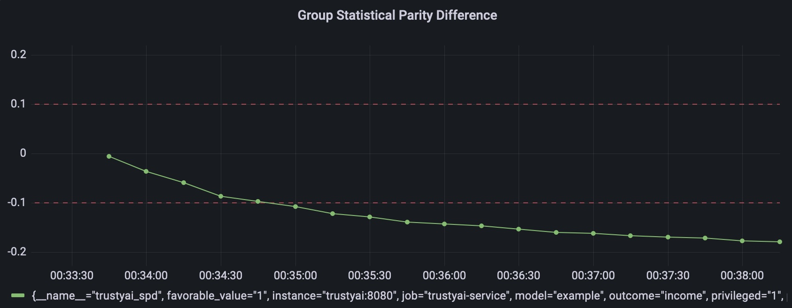

# trustyai-service

## Running

### Locally

Build the container image with

```shell
mvn clean install
```

and run the container using (either `docker`, `podman`):

```shell
docker run -p 8080:8080 --env STORAGE_FORMAT=CSV \
    --env MODEL_NAME=example \
    --env KSERVE_TARGET=localhost \
    trustyai/trustyai-service:1.0.0-SNAPSHOT -d 
```

There is also a `compose` configuration which install the service, Prometheus and Grafana.
To run it, use:

```shell
docker-compose compose.yaml up -d # or podman-compose
```

## Endpoints

The OpenAPI schema can be displayed using

```shell
curl -X GET --location "http://localhost:8080/q/openapi"
```

### Metrics

#### Statistical Parity Difference

Get statistical parity difference at `/metrics/spd`

```shell
curl -X POST --location "http://localhost:8080/metrics/spd" \
    -H "Content-Type: application/json" \
    -d "{
          \"protectedAttribute\": \"gender\",
          \"favorableOutcome\": 1,
          \"outcomeName\": \"income\",
          \"privilegedAttribute\": 1,
          \"unprivilegedAttribute\": 0
        }"
```

Returns:

```http request
HTTP/1.1 200 OK
content-length: 85
Content-Type: application/json;charset=UTF-8

{
  "type": "metric",
  "name": "SPD",
  "value": -0.15670061634672994,
  "timestamp": 1675771199352
}
```

#### Disparate Impact Ratio

```shell
curl -X POST --location "http://localhost:8080/metrics/dir" \
    -H "Content-Type: application/json" \
    -d "{
          \"protectedAttribute\": \"gender\",
          \"favorableOutcome\": 1,
          \"outcomeName\": \"income\",
          \"privilegedAttribute\": 1,
          \"unprivilegedAttribute\": 0
        }"
```

```http request
HTTP/1.1 200 OK
content-length: 84
Content-Type: application/json;charset=UTF-8

{
  "type": "metric",
  "name": "DIR",
  "value": 0.43400672901628895,
  "timestamp": 1675771400859
}
```

### Prometheus

Whenever a metric endpoint is called with a HTTP request, the service also updates
the corresponding Prometheus metric.

The metrics are published at `/q/metrics` and can be consumed directly with Prometheus.
The examples also include a Grafana dashboard to visualize them.



Each Prometheus metric is scoped to a specific `model` and attributes using tags.
For instance, for the SPD metric request above we would have a metric:

```
trustyai_spd{instance="trustyai:8080", 
    job="trustyai-service", 
    model="example", 
    outcome="income", 
    protected="gender"}
```

# Data sources

## Metrics

Data source extend the base `AbstractDataReader` which has the responsibility
of converting any type of data source (flat file on PVC, S3, database, _etc_) into a TrustyAI `Dataframe`.

The type of datasource is passed with the environment variable `STORAGE_FORMAT`.

For demo purposes we abstract the data source to `STORAGE_FORMAT=RANDOM_TEST`
which generates in memory new data points for each request.

## Explainers

An explainer can be linked to the service using the enviroment
variables `KSERVE_TARGET` and `MODEL_NAME`.
These will be used by the service's gRPC client which can natively
query KServe and ModelMesh using that endpoint.

# Deployment

To deploy in Kubernetes or OpenShift, the connection information
can be passed in the manifest as enviroment variables:

```yaml
apiVersion: apps/v1
kind: Deployment
spec:
  template:
    spec:
      containers:
        - env:
            - name: KUBERNETES_NAMESPACE
              valueFrom:
                fieldRef:
                  fieldPath: metadata.namespace
            - name: KSERVE_TARGET
              value: localhost
            - name: STORAGE_FORMAT
              value: RANDOM_TEST
            - name: MODEL_NAME
              value: example
          image: trustyai/trustyai-service:1.0.0-SNAPSHOT
          name: trustyai-service
          ports:
            - containerPort: 8080
              name: http
              protocol: TCP
```

